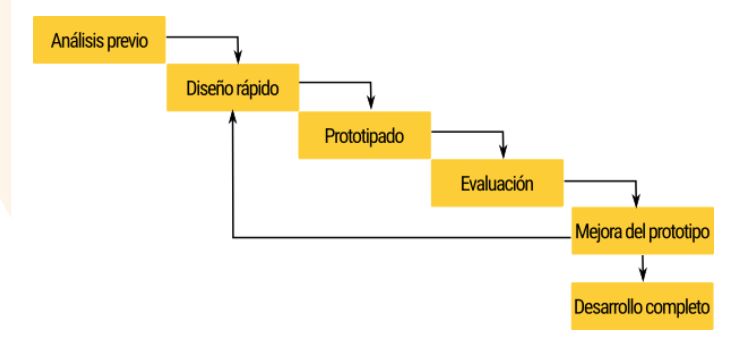

# Caso práctico web de una empresa. 
Vamos a desarrrollar una web de una empresa utilizando un modelo de desarrollo de software. 

Para una página web de una empresa yo seguiría el método de **dessarrollo evolutivo** basado en prototipos siguiendo estos pasos: 

+ Haría un **análisis** previo junto al cliente dejando claro cuales son las metas y las características de la página web.
+ Se hace un **diseño rápido** de la web y un **prototipado**
+ El cliente evalua el prototipo y ve si es de su agrado. 
+ Si el cliente acepta el prototipo este se irá mejorando hasta llegar al desarrollo completo 
+ En cualquier fase de un prototipo el cliente puede dejar indicaciones sobre como mejorar la web y evaluar si el dessarrollo se está llevando a cabo según sus necesidades y preferencias. 

